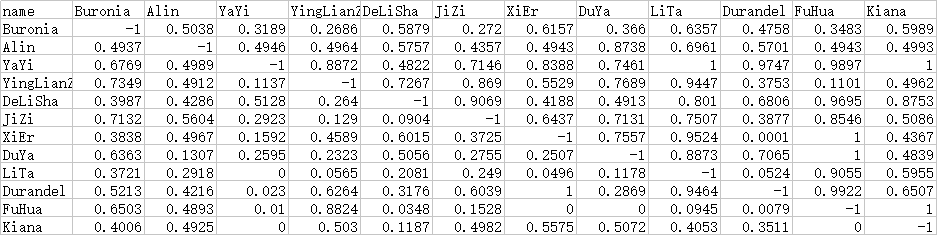

# 2020崩坏3-夏日竞猜活动模拟

## 简介
2020崩坏3-夏日竞猜活动模拟
- `roles.py` 角色属性
- `simulation.py` 模拟帮助函数
- `main.py` 主程序
## 结果
先看横轴再看纵轴，这儿阿琳姐妹打布洛妮娅的胜率是0.5038


## 环境依赖
- numpy
- pandas

## 使用方法
安装模块：
```shell script
$ pip install -r requirments.txt
```
运行：
```shell script
$ python main.py
```
尚不排除计算错误的可能

## 目前完成
- 琪亚娜 (Kiana)
- 阿琳姐妹 (Alin)
- 姬子 (JiZi)
- 德莉莎 (DeLiSha)
- 芽衣 (YaYi)
- 樱莲组 (YingLianZu)
- 渡鸦 (DuYa)
- 布洛妮娅 (Buronia)
- 丽塔 (LiTa)
- 希儿 (XiEr)
- 幽兰戴尔 (Durandel)
- 符华 (FuHua)